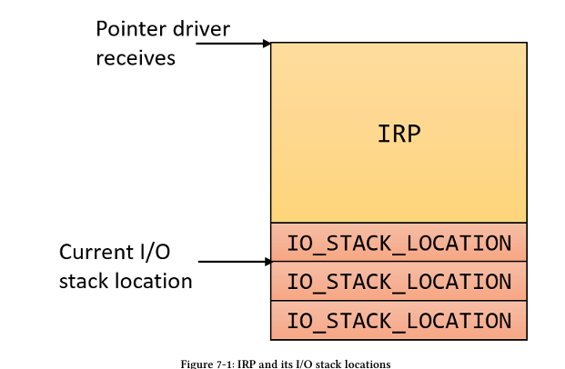
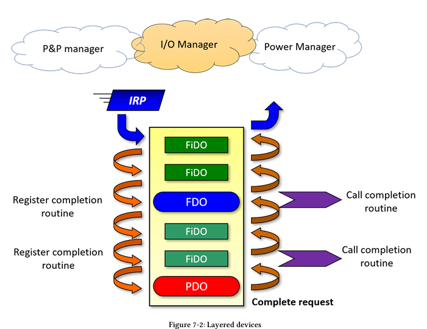
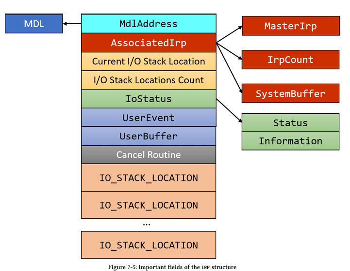
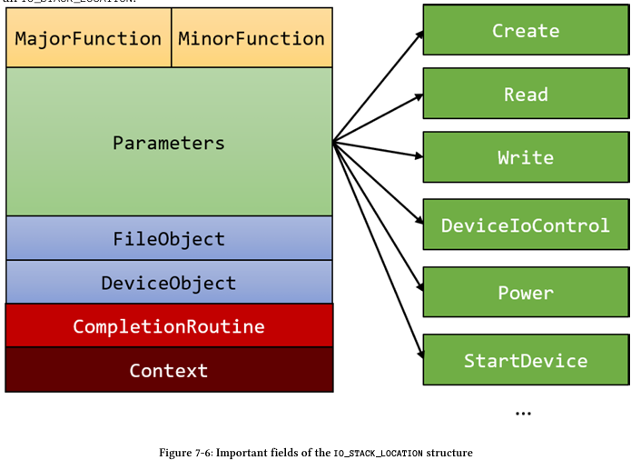

# IRP (I/O Request Packet)

## Intro

Một IRP là một cấu trúc được cấp phát từ non-paged pool (bộ nhớ không phân trang), điển hình là bởi một trong những 'trình quản lý' thuộc tầng Executive (như Trình quản lý I/O, Trình quản lý Plug & Play, Trình quản lý Nguồn), nhưng nó cũng có thể được cấp phát bởi chính driver, có lẽ là để chuyển tiếp một yêu cầu tới một driver khác. Bất kỳ thực thể nào cấp phát IRP thì cũng phải chịu trách nhiệm giải phóng nó.

Một IRP không bao giờ được cấp phát đơn lẻ. Nó luôn đi kèm với một hoặc nhiều cấu trúc Vị trí Ngăn xếp I/O (IO_STACK_LOCATION). Thực tế, khi một IRP được cấp phát, người gọi bắt buộc phải chỉ định bao nhiêu vị trí ngăn xếp I/O cần được cấp phát cùng với IRP đó. Các vị trí ngăn xếp I/O này nằm nối tiếp ngay sau IRP trong bộ nhớ. Số lượng vị trí ngăn xếp I/O chính là số lượng đối tượng thiết bị (device objects) nằm trong ngăn xếp thiết bị (device stack). Chúng ta sẽ thảo luận về ngăn xếp thiết bị trong phần tiếp theo.

Khi một driver nhận được một IRP, nó nhận được một con trỏ trỏ tới bản thân cấu trúc IRP, và nó biết rằng đi theo sau cấu trúc đó là một tập hợp các vị trí ngăn xếp I/O, trong đó có một vị trí dành riêng cho driver đó sử dụng. Để lấy được đúng vị trí ngăn xếp I/O của mình, driver gọi hàm IoGetCurrentIrpStackLocation (thực chất đây là một macro). Hình 7-1 thể hiện cái nhìn khái niệm về một IRP và các vị trí ngăn xếp I/O liên quan của nó."



## Device Nodes

Hệ thống nhập/xuất (I/O) trong Windows lấy thiết bị làm trung tâm (device-centric), thay vì lấy driver làm trung tâm (driver-centric). Điều này dẫn đến một số hệ quả quan trọng:

Các đối tượng thiết bị (Device objects) có thể được đặt tên, và các handle (tay nắm) dẫn tới đối tượng thiết bị có thể được mở. Hàm CreateFile chấp nhận một liên kết tượng trưng (symbolic link) dẫn tới một đối tượng thiết bị. CreateFile không thể nhận tên của driver làm tham số đầu vào.

Windows hỗ trợ phân lớp thiết bị (device layering) - một thiết bị có thể được xếp chồng lên trên một thiết bị khác. Mọi yêu cầu được gửi đến thiết bị lớp dưới sẽ phải đi tới thiết bị lớp trên cùng trước tiên. Việc phân lớp này rất phổ biến đối với các thiết bị dựa trên phần cứng, nhưng nó cũng hoạt động với bất kỳ loại thiết bị nào khác.

Hình 7-2 minh họa một ví dụ về nhiều lớp thiết bị được "xếp chồng" (stacked) lên nhau. Tập hợp các thiết bị này được gọi là một ngăn xếp thiết bị (device stack), đôi khi còn được gọi là nút thiết bị (device node) (mặc dù thuật ngữ nút thiết bị thường được dùng chuyên biệt cho các ngăn xếp thiết bị phần cứng). Hình minh họa cho thấy sáu lớp, hay sáu thiết bị. Mỗi thiết bị trong số này được đại diện bởi một cấu trúc DEVICE_OBJECT, được tạo ra bằng cách gọi hàm tiêu chuẩn IoCreateDevice



Các đối tượng thiết bị khác nhau tạo nên các lớp của nút thiết bị (devnode) được đặt nhãn dựa theo vai trò của chúng trong devnode đó. Các vai trò này có ý nghĩa trong một devnode dựa trên phần cứng.

"Tất cả các đối tượng thiết bị trong hình 7-2 chỉ đơn giản là các cấu trúc DEVICE_OBJECT, mỗi cái được tạo ra bởi một driver khác nhau chịu trách nhiệm cho lớp đó. Nói một cách tổng quát hơn, loại nút thiết bị này không nhất thiết phải liên quan đến các driver thiết bị phần cứng.

Dưới đây là tóm tắt nhanh về ý nghĩa của các nhãn xuất hiện trong hình 7-2:

- PDO (Physical Device Object - Đối tượng Thiết bị Vật lý): Mặc dù tên gọi như vậy, nhưng không có gì là "vật lý" ở đây cả. Đối tượng thiết bị này được tạo ra bởi một bus driver (driver điều khiển bus) - driver chịu trách nhiệm cho bus cụ thể đó (ví dụ: PCI, USB, v.v.). Đối tượng thiết bị này đại diện cho sự thật là có một thiết bị nào đó nằm trong khe cắm đó trên bus đó.

- FDO (Functional Device Object - Đối tượng Thiết bị Chức năng): Đối tượng thiết bị này được tạo ra bởi driver "thực sự"; tức là driver thường được cung cấp bởi nhà sản xuất phần cứng (Vendor), người hiểu tường tận các chi tiết của thiết bị.

- FiDO (Filter Device Object - Đối tượng Thiết bị Lọc): Đây là các thiết bị lọc tùy chọn được tạo ra bởi các driver lọc (filter drivers).

Trong trường hợp này, Trình quản lý Plug & Play (P&P manager) chịu trách nhiệm tải các driver thích hợp, bắt đầu từ dưới lên trên. Ví dụ, giả sử devnode trong hình 7-2 đại diện cho một tập hợp các driver quản lý một card mạng PCI. Chuỗi sự kiện dẫn đến việc tạo ra devnode này có thể được tóm tắt như sau:

- Driver bus PCI (pci.sys) nhận ra rằng có thứ gì đó đang nằm trong khe cắm cụ thể đó. Nó tạo ra một PDO (bằng hàm IoCreateDevice) để đại diện cho sự thật này. Driver bus hoàn toàn không biết liệu đây là card mạng, card màn hình hay thứ gì khác; nó chỉ biết có thứ gì đó ở đó và có thể trích xuất thông tin cơ bản từ bộ điều khiển của nó, chẳng hạn như Vendor ID (Mã nhà cung cấp) và Device ID (Mã thiết bị).

- Driver bus PCI thông báo cho Trình quản lý P&P biết rằng có sự thay đổi trên bus của nó (gọi hàm IoInvalidateDeviceRelations với giá trị liệt kê là BusRelations).

- Trình quản lý P&P yêu cầu một danh sách các PDO được quản lý bởi driver bus. Nó nhận lại được danh sách các PDO, trong đó bao gồm cả PDO mới này.

Bây giờ, nhiệm vụ của Trình quản lý P&P là tìm và tải driver thích hợp để quản lý PDO mới này. Nó gửi một truy vấn đến driver bus để yêu cầu Hardware ID (Mã phần cứng) đầy đủ.

Với Hardware ID trong tay, Trình quản lý P&P tìm kiếm trong Registry tại khóa HKLM\System\CurrentControlSet\Enum\PCI\(HardwareID). Nếu driver đã từng được tải trước đó, nó sẽ được đăng ký ở đó, và Trình quản lý P&P sẽ tải nó. Hình 7-3 hiển thị ví dụ về Hardware ID trong Registry (Driver hiển thị NVIDIA).

Driver (của nhà sản xuất) được tải lên và tạo ra FDO (lại một cuộc gọi IoCreateDevice nữa), nhưng thêm một cuộc gọi bổ sung tới IoAttachDeviceToDeviceStack, qua đó tự gắn nó nằm đè lên lớp trước đó (thường là PDO). Chúng ta sẽ xem cách viết driver lọc tận dụng IoAttachDeviceToDeviceStack trong chương 13."

Các đối tượng thiết bị lọc (filter device objects) cũng được nạp, nếu chúng được đăng ký chính xác trong Registry.

"Các bộ lọc dưới (Lower filters - nằm dưới FDO) nạp theo thứ tự từ dưới lên trên. Mỗi driver lọc được nạp sẽ tạo ra đối tượng thiết bị riêng của nó và gắn (attach) nó lên trên lớp trước đó. Các bộ lọc trên (Upper filters) cũng hoạt động theo cách tương tự nhưng được nạp sau FDO.

Tất cả điều này có nghĩa là với các devnode P&P đang hoạt động, luôn có ít nhất hai lớp: PDO và FDO, nhưng có thể có nhiều lớp hơn nếu có các bộ lọc tham gia. Chúng ta sẽ xem xét việc phát triển bộ lọc cơ bản cho các driver phần cứng trong chương 13.

Việc thảo luận đầy đủ về Plug & Play và cách thức chính xác để xây dựng loại devnode này nằm ngoài phạm vi của cuốn sách này. Mô tả trước đó là không đầy đủ và lướt qua một số chi tiết, nhưng nó sẽ cung cấp cho bạn ý tưởng cơ bản. Mọi devnode đều được xây dựng từ dưới lên trên, bất kể nó có liên quan đến phần cứng hay không.

Các bộ lọc dưới được tìm kiếm ở hai vị trí: khóa Hardware ID (như hình 7-3) và trong Class (Lớp thiết bị) tương ứng dựa trên giá trị ClassGuid được liệt kê dưới đường dẫn HKLM\System\CurrentControlSet\Control\Classes. Tên giá trị chính là LowerFilters và nó là một giá trị chuỗi đa (REG_MULTI_SZ) chứa tên các dịch vụ, trỏ tới cùng một khóa Services. Các bộ lọc trên (Upper filters) được tìm kiếm theo cách tương tự, nhưng tên giá trị là UpperFilters.

Hình 7-4 hiển thị các cài đặt registry cho lớp DiskDrive (Ổ đĩa), lớp này có một bộ lọc dưới và một bộ lọc trên."

## IRP Flow

Trình quản lý tạo ra một IRP cùng với các cấu trúc IO_STACK_LOCATION liên kết với nó - sáu cái trong ví dụ ở hình 7-2. Trình quản lý chỉ khởi tạo cấu trúc IRP chính và vị trí ngăn xếp I/O (stack location) đầu tiên mà thôi. Sau đó, nó chuyển con trỏ của IRP cho lớp trên cùng.

Một driver nhận IRP trong thủ tục điều phối (dispatch routine) thích hợp của nó. Ví dụ, nếu đây là một IRP Đọc (Read IRP), thì driver sẽ được gọi tại chỉ mục IRP_MJ_READ trong mảng MajorFunction của đối tượng driver. Tại thời điểm này, driver có một vài lựa chọn khi xử lý IRP:

- Chuyền yêu cầu xuống dưới: Nếu thiết bị của driver không phải là thiết bị cuối cùng trong devnode, driver có thể chuyền yêu cầu đi tiếp nếu nó không quan tâm đến yêu cầu đó. Điều này thường được thực hiện bởi một driver lọc (filter driver) khi nhận được một yêu cầu mà nó không quan tâm, và để không làm ảnh hưởng đến chức năng của thiết bị (vì yêu cầu thực chất là dành cho thiết bị lớp dưới), driver có thể chuyền nó xuống. Việc này phải được thực hiện bằng hai cuộc gọi:

  - Gọi IoSkipCurrentIrpStackLocation để đảm bảo thiết bị tiếp theo trong hàng sẽ nhìn thấy thông tin y hệt như thông tin đã đưa cho thiết bị này - nó nên nhìn thấy cùng một vị trí ngăn xếp I/O.

  - Gọi IoCallDriver truyền vào đối tượng thiết bị bên dưới (mà driver đã nhận được vào lúc gọi IoAttachDeviceToDeviceStack) và IRP.

- Trước khi chuyền yêu cầu xuống, driver phải chuẩn bị vị trí ngăn xếp I/O tiếp theo với thông tin thích hợp. Vì trình quản lý I/O chỉ khởi tạo vị trí ngăn xếp I/O đầu tiên, trách nhiệm của mỗi driver là phải khởi tạo cái tiếp theo. Một cách để làm điều đó là gọi IoCopyIrpStackLocationToNext trước khi gọi IoCallDriver. Cách này hoạt động được, nhưng hơi lãng phí nếu driver chỉ muốn lớp dưới nhìn thấy thông tin y hệt. Việc gọi IoSkipCurrentIrpStackLocation là một sự tối ưu hóa, nó làm giảm con trỏ vị trí ngăn xếp I/O hiện tại bên trong IRP, sau đó con trỏ này lại được tăng lên bởi IoCallDriver, vì vậy lớp tiếp theo sẽ nhìn thấy cùng một IO_STACK_LOCATION mà driver này đã thấy. Vũ điệu 'giảm/tăng' này hiệu quả hơn là thực hiện một thao tác sao chép thực sự.

- Xử lý IRP hoàn toàn: Driver nhận IRP có thể xử lý xong IRP mà không cần truyền nó xuống dưới, bằng cách cuối cùng gọi IoCompleteRequest. Các thiết bị bên dưới sẽ không bao giờ nhìn thấy yêu cầu này.

- Kết hợp các lựa chọn trên: Driver có thể kiểm tra IRP, làm gì đó (chẳng hạn như ghi log yêu cầu), và sau đó chuyền nó xuống. Hoặc nó có thể thực hiện một số thay đổi đối với vị trí ngăn xếp I/O tiếp theo, và sau đó chuyền yêu cầu xuống.

- Chuyền yêu cầu xuống (có hoặc không thay đổi) và nhận thông báo khi yêu cầu hoàn thành bởi thiết bị lớp dưới: Bất kỳ lớp nào (trừ lớp thấp nhất) đều có thể thiết lập một thủ tục hoàn thành I/O (completion routine) bằng cách gọi IoSetCompletionRoutine trước khi chuyền yêu cầu xuống. Khi một trong các lớp dưới hoàn thành yêu cầu, thủ tục hoàn thành của driver sẽ được gọi.

- Bắt đầu xử lý IRP bất đồng bộ: Driver có thể muốn xử lý yêu cầu, nhưng nếu yêu cầu đó tốn nhiều thời gian (điển hình cho driver phần cứng, nhưng cũng có thể xảy ra với driver phần mềm), driver có thể đánh dấu IRP là đang chờ xử lý bằng cách gọi IoMarkIrpPending và trả về STATUS_PENDING từ thủ tục điều phối của nó. Cuối cùng, nó sẽ phải hoàn thành IRP.

Một khi lớp nào đó gọi IoCompleteRequest, IRP sẽ quay đầu và bắt đầu 'nổi lên' (bubbling up) về phía người tạo ra IRP (thường là các Trình quản lý hệ thống I/O). Nếu các thủ tục hoàn thành đã được đăng ký, chúng sẽ được gọi theo thứ tự ngược lại với thứ tự đăng ký.

## IRP and I/O Stack Location



Dưới đây là tóm tắt nhanh về các trường này:

- IoStatus: Chứa trạng thái (NT_STATUS) của IRP và một trường thông tin (Information). Trường Information là một trường đa hình (polymorphic), có kiểu dữ liệu là ULONG_PTR (số nguyên 32 hoặc 64-bit), nhưng ý nghĩa của nó phụ thuộc vào loại IRP. Ví dụ, đối với IRP Đọc và Ghi, ý nghĩa của nó là số lượng byte đã được chuyển trong thao tác đó.

- UserBuffer: Chứa con trỏ bộ đệm thô (raw buffer pointer) trỏ tới bộ đệm của người dùng đối với các IRP có liên quan. Ví dụ, các IRP Đọc và Ghi lưu con trỏ bộ đệm của người dùng trong trường này. Trong các IRP DeviceIoControl, trường này trỏ tới bộ đệm đầu ra (output buffer) được cung cấp trong yêu cầu.

- UserEvent: Đây là con trỏ tới một đối tượng sự kiện (KEVENT) được cung cấp bởi client (máy khách/người dùng) nếu cuộc gọi là bất đồng bộ và sự kiện đó được cung cấp. Từ user mode, sự kiện này có thể được cung cấp (thông qua một HANDLE) trong cấu trúc OVERLAPPED - cấu trúc bắt buộc để gọi các thao tác I/O bất đồng bộ.

- AssociatedIrp: Đây là một union (hợp bao) chứa ba thành viên, trong đó chỉ có (tối đa) một thành viên là hợp lệ tại một thời điểm:

  - SystemBuffer: Thành viên được sử dụng thường xuyên nhất. Nó trỏ tới một bộ đệm thuộc non-paged pool (bộ nhớ không phân trang) do hệ thống cấp phát, được sử dụng cho các thao tác Buffered I/O (I/O có bộ đệm). Xem phần "Buffered I/O" ở sau chương này để biết chi tiết.

  - MasterIrp: Một con trỏ trỏ tới IRP "chủ" (master), nếu IRP này là một IRP liên kết (associated). Ý tưởng này được hỗ trợ bởi trình quản lý I/O, nơi một IRP là "chủ" có thể có nhiều IRP "liên kết". Khi tất cả các IRP liên kết hoàn thành, IRP chủ sẽ tự động hoàn thành. MasterIrp hợp lệ đối với một IRP liên kết - nó trỏ tới IRP chủ.

  - IrpCount: Đối với bản thân IRP chủ, trường này chỉ định số lượng các IRP liên kết gắn với IRP chủ này.

Lưu ý: Việc sử dụng IRP chủ và liên kết khá hiếm. Chúng ta sẽ không sử dụng cơ chế này trong cuốn sách này.

- CancelRoutine: Một con trỏ tới hàm hủy (cancel routine), hàm này sẽ được gọi (nếu khác NULL) nếu driver được yêu cầu hủy IRP, chẳng hạn như khi user mode gọi hàm CancelIo hoặc CancelIoEx. Các driver phần mềm hiếm khi cần các hàm hủy, vì vậy chúng ta sẽ không sử dụng chúng trong hầu hết các ví dụ.

- MdlAddress: Trỏ tới một Danh sách Mô tả Bộ nhớ (Memory Descriptor List - MDL) tùy chọn. Một MDL là cấu trúc dữ liệu kernel biết cách mô tả một bộ đệm trong RAM vật lý. MdlAddress được sử dụng chủ yếu với Direct I/O (xem phần "Direct I/O" sau chương này).



Mọi IRP đều đi kèm với một hoặc nhiều IO_STACK_LOCATION. Hình 7-6 hiển thị các trường quan trọng trong một IO_STACK_LOCATION.

Dưới đây là tóm tắt về các trường được hiển thị trong hình 7-6:

- MajorFunction: Đây là mã chức năng chính của IRP (ví dụ: IRP_MJ_CREATE, IRP_MJ_READ, v.v.). Trường này đôi khi hữu ích nếu driver trỏ nhiều mã chức năng chính về cùng một hàm xử lý (handling routine). Trong hàm đó, driver có thể muốn phân biệt giữa các mã chức năng chính bằng cách sử dụng trường này.

- MinorFunction: Một số loại IRP có các chức năng phụ. Đó là IRP_MJ_PNP, IRP_MJ_POWER và IRP_MJ_SYSTEM_CONTROL (WMI). Mã xử lý điển hình cho các loại này thường có một câu lệnh switch dựa trên MinorFunction. Chúng ta sẽ không sử dụng các loại IRP này trong sách này, ngoại trừ trường hợp các driver lọc cho thiết bị phần cứng, cái mà chúng ta sẽ xem xét chi tiết ở chương 13.

- FileObject: Đối tượng tập tin (FILE_OBJECT) liên kết với IRP này. Trong hầu hết các trường hợp thì không cần dùng đến, nhưng nó có sẵn cho các thủ tục điều phối (dispatch routines) nào cần nó.

- DeviceObject: Đối tượng thiết bị liên kết với IRP này. Các thủ tục điều phối nhận được một con trỏ trỏ tới đối tượng này rồi, nên thông thường việc truy cập trường này là không bắt buộc.

- CompletionRoutine: Hàm hoàn thành (completion routine) đã được thiết lập bởi lớp trước đó (lớp bên trên) (được thiết lập bằng IoSetCompletionRoutine), nếu có.

- Context: Tham số ngữ cảnh để truyền vào hàm hoàn thành (nếu có).

- Parameters: Một union (hợp bao) khổng lồ chứa nhiều cấu trúc, mỗi cấu trúc hợp lệ cho một thao tác cụ thể. Ví dụ, trong một thao tác Đọc (IRP_MJ_READ), trường cấu trúc Parameters.Read nên được sử dụng để lấy thêm thông tin về thao tác Đọc đó.

## Dispatch Routines

Trong chương 4, chúng ta đã thấy một khía cạnh quan trọng của DriverEntry - thiết lập các thủ tục điều phối. Đây là các hàm được kết nối với các mã chức năng chính (major function codes). Trường MajorFunction trong cấu trúc DRIVER_OBJECT chính là mảng chứa các con trỏ hàm, được đánh chỉ mục bởi mã chức năng chính.

Tất cả các thủ tục điều phối đều có cùng một nguyên mẫu (prototype), được lặp lại ở đây cho thuận tiện bằng cách sử dụng DRIVER_DISPATCH được định nghĩa trong WDK (đã được đơn giản hóa một chút cho rõ ràng):

```C++
typedef NTSTATUS DRIVER_DISPATCH (
    _In_ PDEVICE_OBJECT DeviceObject,
    _Inout_ PIRP Irp
);
```

Thủ tục điều phối tương ứng (dựa trên mã chức năng chính) là thủ tục đầu tiên trong một driver nhìn thấy yêu cầu. Thông thường, nó được gọi trong ngữ cảnh luồng yêu cầu (requesting thread context), tức là luồng đã gọi API tương ứng (ví dụ: ReadFile) ở mức IRQL PASSIVE_LEVEL (0).

Dưới đây là danh sách các thủ tục điều phối phổ biến nhất cho một driver phần mềm:

- IRP_MJ_CREATE: Tương ứng với một cuộc gọi CreateFile từ user mode hoặc ZwCreateFile trong kernel mode. Mã chức năng chính này về cơ bản là bắt buộc, nếu không sẽ chẳng có client (khách) nào có thể mở được handle (tay nắm) tới thiết bị do driver này kiểm soát. Hầu hết các driver chỉ đơn giản là hoàn thành IRP này với trạng thái thành công.

- IRP_MJ_CLOSE: Ngược lại với IRP_MJ_CREATE. Được gọi bởi CloseHandle từ user mode hoặc ZwClose từ kernel mode khi handle cuối cùng tới file object sắp bị đóng. Hầu hết các driver chỉ hoàn thành yêu cầu thành công, nhưng nếu có thứ gì đó quan trọng đã được thực hiện trong IRP_MJ_CREATE, thì đây là nơi nó nên được hoàn tác (dọn dẹp).

- IRP_MJ_READ: Tương ứng với một thao tác đọc, thường được gọi từ user mode bởi ReadFile hoặc kernel mode bởi ZwReadFile

- IRP_MJ_WRITE: Tương ứng với một thao tác ghi, thường được gọi từ user mode bởi WriteFile hoặc kernel mode bởi ZwWriteFile

- IRP_MJ_DEVICE_CONTROL: Tương ứng với cuộc gọi DeviceIoControl từ user mode hoặc ZwDeviceIoControlFile từ kernel mode (có các API khác trong kernel cũng có thể tạo ra IRP IRP_MJ_DEVICE_CONTROL

- IRP_MJ_INTERNAL_DEVICE_CONTROL: Tương tự như IRP_MJ_DEVICE_CONTROL, nhưng chỉ dành cho các người gọi từ kernel (kernel callers).

## Hoàn thành một Yêu cầu

"Một khi driver đã quyết định xử lý một IRP (nghĩa là nó không chuyển tiếp xuống cho driver khác), thì cuối cùng nó bắt buộc phải hoàn thành IRP đó. Nếu không, chúng ta sẽ gặp phải vấn đề rò rỉ tài nguyên (leak) - luồng yêu cầu sẽ không thể thực sự chấm dứt, và kéo theo đó, tiến trình chứa luồng đó cũng sẽ bị treo lại, dẫn đến việc tạo ra một 'tiến trình xác sống' (zombie process).

Hoàn thành một yêu cầu nghĩa là gọi hàm IoCompleteRequest sau khi đã thiết lập trạng thái của yêu cầu và thông tin bổ sung. Nếu việc hoàn thành được thực hiện ngay trong thủ tục điều phối (dispatch routine) - một trường hợp phổ biến đối với driver phần mềm - thì thủ tục này phải trả về (return) đúng cái trạng thái (NTSTATUS) đã được đặt vào bên trong IRP.


