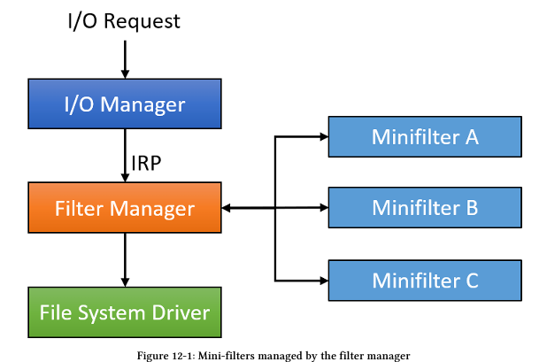
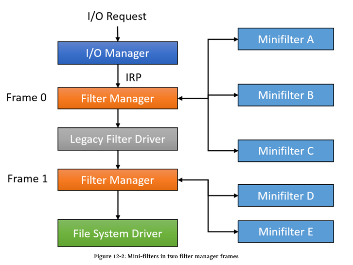

# File System Mini-Filters

Hệ thống tập tin (File Systems) là đích đến của các hoạt động I/O nhằm truy cập các tệp tin và các thiết bị khác được triển khai dưới dạng hệ thống tập tin (chẳng hạn như named pipes - đường ống có tên và mailslots - khe thư).

"Windows hỗ trợ một vài hệ thống tập tin, đáng chú ý nhất là NTFS, hệ thống tập tin bản địa (native) của nó. Lọc hệ thống tập tin (File system filtering) là cơ chế cho phép các driver chặn bắt (intercept) các lời gọi gửi đến hệ thống tập tin. Điều này hữu ích cho nhiều loại phần mềm, chẳng hạn như phần mềm diệt virus (anti-viruses), sao lưu (backups), mã hóa (encryption), chuyển hướng (redirection), và nhiều hơn nữa.

Trong một thời gian dài, Windows đã hỗ trợ một mô hình lọc được gọi là file system filters (các bộ lọc hệ thống tập tin), mà hiện nay được gọi là các bộ lọc hệ thống tập tin cũ (legacy file system filters). Một mô hình mới hơn có tên là file system mini-filters (bộ lọc mini hệ thống tập tin) đã được phát triển để thay thế cơ chế lọc cũ. Mini-filters dễ viết hơn ở nhiều khía cạnh, và là cách thức được ưu tiên để phát triển các driver lọc hệ thống tập tin. Trong chương này, chúng ta sẽ đề cập đến những kiến thức cơ bản về file system mini-filters.

## Intro

Các bộ lọc hệ thống tập tin kiểu cũ (Legacy file system filters) nổi tiếng là khó viết.

"Người viết driver phải lo liệu đủ loại chi tiết nhỏ nhặt, nhiều thứ trong số đó là mã rập khuôn (boilerplate), làm phức tạp quá trình phát triển. Các bộ lọc kiểu cũ không thể gỡ bỏ (unload) khi hệ thống đang chạy, nghĩa là hệ thống phải khởi động lại để nạp phiên bản cập nhật của driver. Với mô hình mini-filter, các driver có thể được nạp và gỡ bỏ động, do đó hợp lý hóa quy trình phát triển đáng kể.

Về mặt nội bộ, một bộ lọc kiểu cũ do Windows cung cấp có tên là Filter Manager (FltMgr) có nhiệm vụ quản lý các mini-filter. Một sự phân lớp bộ lọc điển hình được hiển thị trong hình 12-1.

Mỗi mini-filter có một Độ cao (Altitude) riêng, quyết định vị trí tương đối của nó trong ngăn xếp thiết bị. Filter Manager là người nhận các IRP giống như bất kỳ bộ lọc kiểu cũ nào khác và sau đó gọi các mini-filter mà nó đang quản lý, theo thứ tự độ cao giảm dần.

Trong một số trường hợp bất thường, có thể có một bộ lọc kiểu cũ khác nằm trong phân cấp, điều này có thể gây ra sự 'chia tách' mini-filter, trong đó một số nằm ở độ cao cao hơn bộ lọc kiểu cũ và một số thấp hơn. Trong trường hợp như vậy, nhiều hơn một thể hiện (instance) của Filter Manager sẽ được nạp, mỗi cái quản lý các mini-filter của riêng nó. Mỗi thể hiện Filter Manager như vậy được gọi là một Khung (Frame). Hình 12-2 hiển thị một ví dụ như vậy với hai khung."

## Loading and Unloading

"Các driver Mini-filter phải được nạp giống như bất kỳ driver nào khác. API ở chế độ người dùng (user mode) được sử dụng là FilterLoad, truyền vào tên của driver (chính là khóa của nó trong registry tại HKLM\System\CurrentControlSet\Services\drivername). Về mặt nội bộ, API hạt nhân FltLoadFilter sẽ được gọi, với ngữ nghĩa tương tự. Giống như bất kỳ driver nào khác, đặc quyền SeLoadDriverPrivilege bắt buộc phải hiện diện (và được kích hoạt) trong token của người gọi nếu được gọi từ user mode. Theo mặc định, quyền này có sẵn trong các token cấp quản trị (admin), nhưng không có trong các token người dùng tiêu chuẩn.

Việc nạp một driver mini-filter tương đương với việc nạp một driver phần mềm tiêu chuẩn. Tuy nhiên, việc gỡ bỏ (unloading) thì không giống như vậy.

Việc gỡ bỏ một mini-filter được thực hiện bằng API FilterUnload trong user mode, hoặc FltUnloadFilter trong kernel mode. Thao tác này yêu cầu đặc quyền tương tự như khi nạp, nhưng không được đảm bảo sẽ thành công, bởi vì hàm callback FilterUnload của mini-filter (sẽ thảo luận sau) được gọi, và hàm này có thể đánh trượt yêu cầu khiến cho driver vẫn tiếp tục được nạp.

Mặc dù việc sử dụng các API để nạp và gỡ bỏ bộ lọc có những công dụng riêng, nhưng trong quá trình phát triển, thường dễ dàng hơn khi sử dụng một công cụ tích hợp sẵn có thể thực hiện việc đó (và nhiều việc khác nữa) gọi là fltmc.exe (nằm trong thư mục System32). Gọi công cụ này (từ cửa sổ lệnh được nâng quyền Admin) mà không có tham số sẽ liệt kê các mini-filter đang được nạp hiện tại. Dưới đây là đầu ra từ một máy tính Windows 11:"

