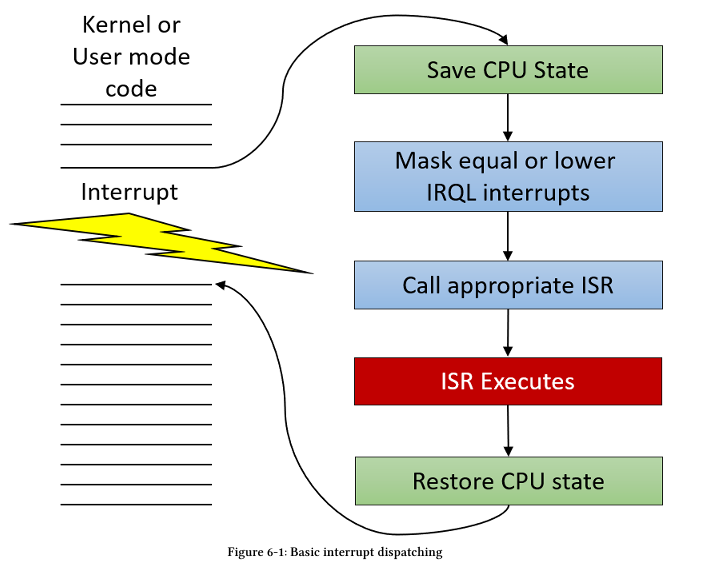
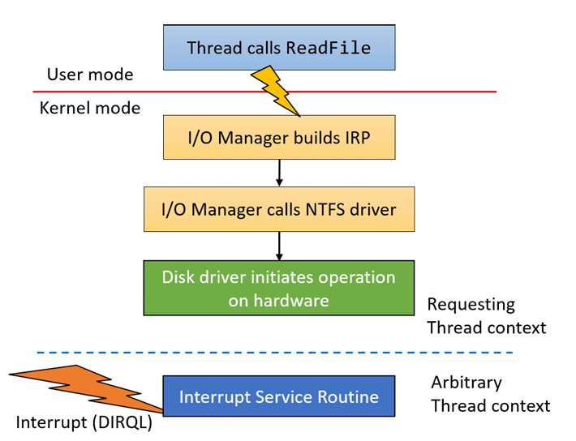

# Kernel

## Interrupt Request Level (IRQL)

Thread và Thread Priority được xem xét khi số lượng luồng muốn chạy nhiều hơn số lượng vi xử lý (CPU).

Một thao tác (I/O) được thực hiện bởi một ổ đĩa. Khi thao tác hoàn tất, ổ đĩa sẽ thông báo việc hoàn thành bằng cách gửi một Interrupt (Yêu cầu ngắt). Interrupt này được kết nối với một Interrupt Controller, sau đó bộ điều khiển này sẽ gửi yêu cầu đến vi xử lý để xử lý.

Mọi ngắt phần cứng đều được gắn với một mức ưu tiên, gọi là Mức Yêu cầu Ngắt (IRQL) (đừng nhầm lẫn với đường truyền vật lý của ngắt được gọi là IRQ), mức này được xác định bởi HAL (Hardware Abstraction Layer). Ngữ cảnh của mỗi vi xử lý đều có một IRQL riêng, giống như bất kỳ thanh ghi nào. IRQL có thể được triển khai bởi phần cứng CPU hoặc không, nhưng điều này về cơ bản không quan trọng. IRQL nên được coi giống như bất kỳ thanh ghi CPU nào khác."

Quy tắc cơ bản là bộ vi xử lý (CPU) sẽ thực thi mã có IRQL cao nhất (task quan trọng thì làm trước).

Ví dụ, nếu IRQL của CPU đang là 0 tại một thời điểm nào đó, và một ngắt có IRQL là 5 xuất hiện, CPU sẽ lưu trạng thái (ngữ cảnh - context) của nó vào ngăn xếp kernel (kernel stack) của luồng hiện tại, nâng IRQL lên mức 5 và sau đó thực thi ISR (Trình xử lý ngắt) gắn liền với ngắt đó. Khi ISR hoàn thành, IRQL sẽ hạ xuống mức trước đó, tiếp tục thực thi đoạn mã đang chạy dở dang như thể ngắt chưa từng xảy ra. Trong khi ISR đang chạy, các ngắt khác đi đến có IRQL bằng 5 hoặc thấp hơn sẽ không thể ngắt bộ vi xử lý này. Tuy nhiên, nếu IRQL của ngắt mới cao hơn 5, CPU sẽ lại lưu trạng thái, nâng IRQL lên mức mới, thực thi ISR thứ hai gắn với ngắt thứ hai đó, và khi hoàn tất, nó sẽ hạ về IRQL 5, khôi phục trạng thái và tiếp tục chạy ISR ban đầu.

Về cơ bản, việc nâng IRQL sẽ chặn tạm thời các mã có IRQL bằng hoặc thấp hơn nó.



việc chuyển ngữ cảnh (context switching) là không thể thực hiện được khi IRQL của bộ vi xử lý từ mức 2 trở lên, do đó không có cách nào để một luồng khác có thể 'len lỏi' vào trong khi các ISR này đang thực thi.

Khi mã chế độ người dùng (user-mode) đang thực thi, IRQL luôn là 0. Hầu hết mã chế độ kernel (kernel-mode) cũng chạy với IRQL bằng 0. Tuy nhiên, trong chế độ kernel, việc nâng mức IRQL trên bộ vi xử lý hiện tại là hoàn toàn có thể.

Các mức IRQL quan trọng được mô tả dưới đây:

- PASSIVE_LEVEL trong WDK (0): Đây là IRQL "bình thường" cho một CPU. Mã chế độ người dùng (User-mode) luôn chạy ở mức này. Việc lập lịch luồng (thread scheduling) hoạt động bình thường.
- APC_LEVEL (1): Được sử dụng cho các APC kernel đặc biệt (Asynchronous Procedure Calls - Lời gọi thủ tục bất đồng bộ, sẽ được thảo luận sau trong chương này). Việc lập lịch luồng vẫn hoạt động bình thường.
- DISPATCH_LEVEL (2): Đây là nơi mọi thứ thay đổi hoàn toàn. Bộ lập lịch (scheduler) không thể thức dậy trên CPU này. Truy cập bộ nhớ phân trang (paged memory) là không được phép - việc truy cập như vậy sẽ gây sập hệ thống (crash). Vì bộ lập lịch không thể can thiệp, việc chờ đợi trên các đối tượng kernel (waiting on kernel objects) là không được phép (sẽ gây sập hệ thống nếu sử dụng). (Paged memory là dữ liệu có thể bị Windows đẩy từ RAM xuống ổ cứng (Swap file) để tiết kiệm RAM. Vấn đề: Việc đọc ổ cứng tốn thời gian và cần Bộ lập lịch hoạt động. Nhưng ở DISPATCH_LEVEL, Bộ lập lịch đã bị tắt. => Windows không thể lấy dữ liệu lên được. Giải pháp: Chỉ được dùng bộ nhớ Non-Paged Pool)
- Device IRQL (IRQL Thiết bị): Một dải các mức được sử dụng cho các ngắt phần cứng (từ 3 đến 11 trên hệ thống x64/ARM/ARM64, từ 3 đến 26 trên x86). Tất cả các quy tắc áp dụng cho IRQL 2 cũng được áp dụng tại đây.
- Mức cao nhất (HIGH_LEVEL): Đây là IRQL cao nhất, che chắn (masking) tất cả mọi ngắt. Được sử dụng bởi một số API xử lý thao tác danh sách liên kết. Các giá trị thực tế là 15 (trên x64/ARM/ARM64) và 31 (trên x86).

Khi IRQL của một bộ vi xử lý được nâng lên mức 2 hoặc cao hơn (dù vì lý do gì), sẽ có những hạn chế nhất định áp dụng cho đoạn mã đang thực thi: 

- Truy cập vào vùng nhớ không nằm trong bộ nhớ vật lý (RAM) là lỗi chí mạng và sẽ gây sập hệ thống. Điều này có nghĩa là việc truy cập dữ liệu từ vùng non-paged pool (bộ nhớ không phân trang) luôn an toàn, trong khi truy cập dữ liệu từ paged pool (bộ nhớ phân trang) hoặc từ các bộ đệm do người dùng cung cấp (user supplied buffers) là không an toàn và cần phải tránh.
- Việc chờ đợi trên bất kỳ đối tượng kernel nào (ví dụ: mutex hoặc event) sẽ gây sập hệ thống, trừ khi thời gian chờ (timeout) bằng 0 thì vẫn được phép. (Chúng ta sẽ thảo luận về các đối tượng điều phối và việc chờ đợi ở phần sau của chương này, trong mục Đồng bộ hóa Luồng.)

Những hạn chế này xuất phát từ thực tế là bộ lập lịch (scheduler) "hoạt động" ở mức IRQL 2; do đó, nếu IRQL của bộ vi xử lý đã ở mức 2 hoặc cao hơn, bộ lập lịch sẽ không thể "thức dậy" (hoạt động) trên bộ vi xử lý đó, và vì thế quá trình chuyển ngữ cảnh (context switches - thay thế luồng đang chạy bằng một luồng khác trên CPU này) không thể diễn ra.

Tại sao truy cập Paged Pool lại gây chết máy (Crash)? Đây là chuỗi sự kiện sẽ gây ra Màn hình xanh (BSOD):

1. Cơ chế Paging: Windows tiết kiệm RAM bằng cách đẩy những dữ liệu ít dùng từ RAM xuống ổ cứng (vào file pagefile.sys). Vùng nhớ này gọi là Paged Pool.

2. Page Fault: Khi code của bạn cố đọc dữ liệu từ Paged Pool, nếu dữ liệu đó đang nằm ở ổ cứng (không có trên RAM), CPU sẽ phát sinh một ngoại lệ gọi là Page Fault.

3. Xử lý Page Fault: Để xử lý lỗi này, Windows cần:

- Tạm dừng luồng hiện tại.
- Gọi trình quản lý bộ nhớ để đọc dữ liệu từ đĩa lên RAM.
- QUAN TRỌNG: Việc đọc đĩa mất nhiều thời gian, nên Windows cần Bộ lập lịch (Scheduler) để chuyển sang luồng khác chạy trong lúc chờ ổ cứng.

4. Vấn đề ở IRQL 2: Bộ lập lịch chạy ở IRQL 2. Nếu code của bạn cũng đang chạy ở IRQL 2 (hoặc cao hơn), Bộ lập lịch không có quyền ưu tiên cao hơn để chen vào (Preempt).

5. Kết quả: Hệ thống rơi vào ngõ cụt. Cần dữ liệu để chạy tiếp -> Dữ liệu ở ổ cứng -> Cần Scheduler để lấy dữ liệu -> Scheduler bị chặn bởi chính code hiện tại -> BSOD: IRQL_NOT_LESS_OR_EQUAL hoặc PAGE_FAULT_IN_NONPAGED_AREA.

Trong chế độ kernel, IRQL có thể được nâng lên bằng hàm KeRaiseIrql và hạ xuống trở lại bằng KeLowerIrql. Dưới đây là một đoạn mã mẫu giúp nâng IRQL lên mức DISPATCH_LEVEL (2), và sau đó hạ nó xuống sau khi thực thi một số lệnh tại mức IRQL này.

```C++
// giả sử IRQL hiện tại <= DISPATCH_LEVEL
KIRQL oldIrql; 
// KIRQL được định nghĩa là kiểu UCHAR (số nguyên không dấu 1 byte)

KeRaiseIrql(DISPATCH_LEVEL, &oldIrql);

NT_ASSERT(KeGetCurrentIrql() == DISPATCH_LEVEL);

// thực hiện công việc tại mức IRQL DISPATCH_LEVEL
// ... (Lưu ý: Không được truy cập Paged Pool, không được Wait)

KeLowerIrql(oldIrql);
```

Nếu bạn nâng IRQL, hãy chắc chắn rằng bạn hạ nó xuống ngay trong cùng một hàm. Việc thoát khỏi một hàm (return) với mức IRQL cao hơn lúc mới vào hàm đó là quá nguy hiểm. Ngoài ra, hãy đảm bảo rằng KeRaiseIrql thực sự là nâng IRQL lên (mức mới > mức cũ) và KeLowerIrql thực sự là hạ nó xuống; nếu không, hệ thống sẽ bị sập (crash)."

Độ ưu tiên của Luồng (Thread Priorities) so với IRQL: "IRQL là một thuộc tính của bộ vi xử lý (CPU). Độ ưu tiên (Priority) là thuộc tính của một luồng (thread). Độ ưu tiên của luồng chỉ có ý nghĩa khi IRQL < 2. Một khi luồng đang thực thi nâng IRQL lên mức 2 hoặc cao hơn, độ ưu tiên của nó không còn ý nghĩa gì nữa — về mặt lý thuyết, nó sở hữu một 'quantum' (định mức thời gian) vô hạn — nó sẽ tiếp tục chạy mãi cho đến khi nó tự hạ IRQL xuống dưới mức 2. Đương nhiên, việc tiêu tốn quá nhiều thời gian ở mức IRQL >= 2 không phải là điều tốt; vì chắc chắn lúc đó mã người dùng (user mode code) sẽ không được chạy. Đây chỉ là một trong những lý do tại sao có những hạn chế nghiêm ngặt đối với những gì mã lệnh có thể làm ở các cấp độ này. Task Manager hiển thị lượng thời gian CPU tiêu tốn ở IRQL 2 hoặc cao hơn thông qua một tiến trình giả (pseudo-process) có tên là System Interrupts; phần mềm Process Explorer gọi nó là Interrupts. Hình 6-3 hiển thị ảnh chụp màn hình từ Task Manager và hình 6-4 hiển thị thông tin tương tự trong Process Explorer."

## Deferred Procedure Calls (Lời gọi thủ tục hoãn lại)



Hình 6-5 hiển thị một chuỗi sự kiện điển hình khi một máy khách (client) gọi một thao tác I/O (Nhập/Xuất). Trong hình này, một luồng chế độ người dùng (user mode thread) mở một handle tới một tập tin, và phát lệnh đọc sử dụng hàm ReadFile.

Vì luồng này có thể thực hiện một cuộc gọi bất đồng bộ (asynchronous call), nó lấy lại quyền điều khiển gần như ngay lập tức và có thể làm việc khác.

Driver nhận yêu cầu này sẽ gọi driver hệ thống tập tin (ví dụ: NTFS), driver này có thể gọi các driver khác bên dưới nó, cho đến khi yêu cầu đến được driver đĩa, nơi sẽ khởi tạo thao tác trên phần cứng đĩa thực tế. Tại thời điểm đó, không có mã lệnh nào cần thực thi cả, vì phần cứng đang "tự làm việc của nó".

Khi phần cứng hoàn tất thao tác đọc, nó phát ra một tín hiệu ngắt (interrupt). Điều này khiến Trình xử lý ngắt (ISR) gắn với ngắt đó thực thi tại mức Device IRQL (lưu ý rằng luồng đang xử lý yêu cầu lúc này là ngẫu nhiên/bất kỳ, vì ngắt đến một cách bất đồng bộ).

việc hoàn thành một yêu cầu (request) được thực hiện bằng cách gọi hàm IoCompleteRequest. Vấn đề là tài liệu quy định hàm này chỉ được phép gọi ở mức IRQL <= DISPATCH_LEVEL (2). Điều này có nghĩa là ISR (chạy ở mức Device IRQL > 2) không thể gọi IoCompleteRequest, nếu cố tình gọi sẽ làm sập hệ thống (crash). Vậy ISR phải làm gì? hàm này tương đối "đắt đỏ" (tốn nhiều thời gian xử lý). Nếu cho phép gọi nó trong ISR, nghĩa là ISR sẽ mất nhiều thời gian hơn đáng kể để thực thi, và vì ISR chạy ở IRQL cao, nó sẽ che chắn (chặn) các ngắt khác trong một khoảng thời gian dài hơn. Cơ chế cho phép ISR gọi IoCompleteRequest (và các hàm khác có hạn chế tương tự) sớm nhất có thể chính là sử dụng Deferred Procedure Call (DPC - Lời gọi thủ tục hoãn lại). Một DPC là một đối tượng gói gọn một hàm sẽ được gọi tại mức IRQL DISPATCH_LEVEL. Tại mức IRQL này, việc gọi IoCompleteRequest là được phép.

Bạn có thể thắc mắc tại sao ISR không đơn giản là hạ IRQL hiện tại xuống DISPATCH_LEVEL, gọi IoCompleteRequest, rồi nâng IRQL trở lại giá trị ban đầu? Điều này có thể gây ra Deadlock (Treo cứng). Chúng ta sẽ thảo luận lý do sau trong chương này ở phần Spin Locks.

Driver đăng ký ISR sẽ chuẩn bị trước một DPC, bằng cách cấp phát một cấu trúc KDPC từ vùng nhớ non-paged pool và khởi tạo nó với một hàm callback bằng KeInitializeDpc. Sau đó, khi ISR được gọi, ngay trước khi thoát hàm, ISR yêu cầu DPC thực thi sớm nhất có thể bằng cách đưa nó vào hàng đợi bằng hàm KeInsertQueueDpc.

Khi hàm DPC thực thi, nó sẽ gọi IoCompleteRequest. Vì vậy, DPC đóng vai trò như một sự thỏa hiệp - nó chạy ở IRQL DISPATCH_LEVEL, nghĩa là không có việc lập lịch (scheduling) nào xảy ra, không được truy cập bộ nhớ phân trang (paged memory), v.v., nhưng nó không quá cao đến mức ngăn chặn các ngắt phần cứng đi vào và được phục vụ trên cùng bộ vi xử lý đó.

Mỗi bộ vi xử lý trên hệ thống đều có hàng đợi DPC riêng. Theo mặc định, KeInsertQueueDpc xếp DPC vào hàng đợi của bộ vi xử lý hiện tại. Khi ISR trả về (return), trước khi IRQL có thể hạ xuống 0, hệ thống sẽ kiểm tra xem có DPC nào trong hàng đợi của bộ vi xử lý hay không. Nếu có, bộ vi xử lý hạ xuống mức IRQL DISPATCH_LEVEL (2) và sau đó xử lý các DPC trong hàng đợi theo thứ tự Vào trước Ra trước (FIFO), gọi các hàm tương ứng cho đến khi hàng đợi trống rỗng. Chỉ khi đó, IRQL của bộ vi xử lý mới có thể hạ xuống 0 và tiếp tục thực thi mã lệnh ban đầu đã bị gián đoạn lúc ngắt xảy ra.

DPC có thể được tùy chỉnh theo một số cách. Hãy xem tài liệu về các hàm KeSetImportanceDpc và KeSetTargetProcessorDpc.

Hình 6-6 bổ sung thêm quy trình thực thi DPC vào hình 6-5."

## Asynchronous Procedure Calls

Các Lời gọi Thủ tục Bất đồng bộ (APC) cũng là các cấu trúc dữ liệu gói gọn một hàm cần được gọi. Nhưng trái ngược với DPC, một APC nhắm mục tiêu vào một luồng cụ thể, do đó chỉ luồng đó mới có thể thực thi hàm này. Điều này có nghĩa là mỗi luồng đều có một hàng đợi APC gắn liền với nó.

Có ba loại APC:

User mode APCs (APC chế độ người dùng): Những APC này thực thi trong user mode tại mức IRQL PASSIVE_LEVEL chỉ khi luồng đi vào trạng thái cảnh báo (alertable state). Điều này thường đạt được bằng cách gọi một API như SleepEx, WaitForSingleObjectEx, WaitForMultipleObjectsEx và các API tương tự. Tham số cuối cùng của các hàm này có thể được đặt là TRUE để đưa luồng vào trạng thái cảnh báo. Trong trạng thái này, luồng sẽ kiểm tra hàng đợi APC của nó, và nếu không trống, các APC sẽ được thực thi cho đến khi hàng đợi rỗng.

Normal kernel-mode APCs (APC chế độ kernel thông thường): Những APC này thực thi trong kernel mode tại mức IRQL PASSIVE_LEVEL và chiếm quyền (preempt) của mã user-mode (và các APC user-mode).

Special kernel APCs (APC chế độ kernel đặc biệt): Những APC này thực thi trong kernel mode tại mức IRQL APC_LEVEL (1) và chiếm quyền của mã user-mode, các APC kernel thông thường, và các APC user-mode. Những APC này được trình quản lý I/O sử dụng để hoàn thành các thao tác I/O, như sẽ được thảo luận trong chương tiếp theo.