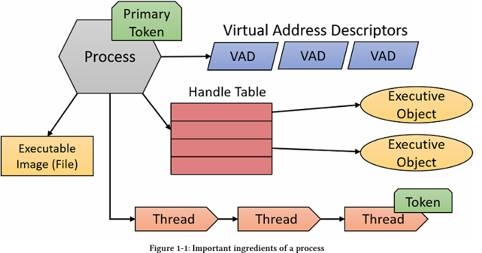
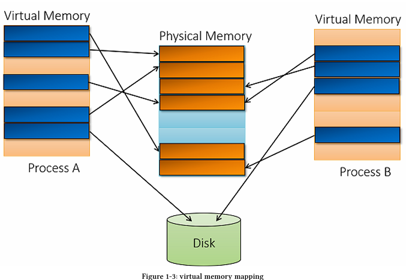
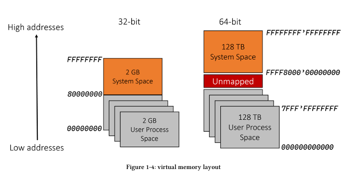
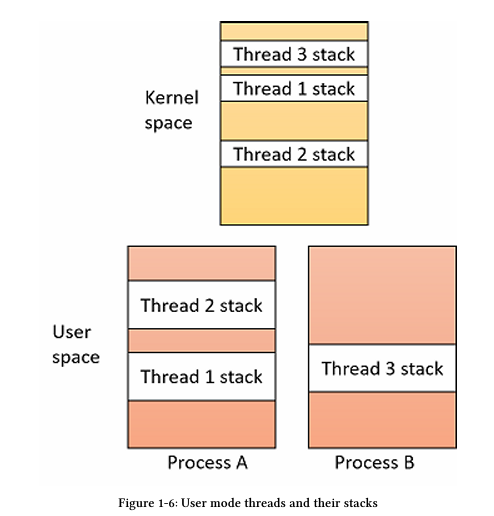
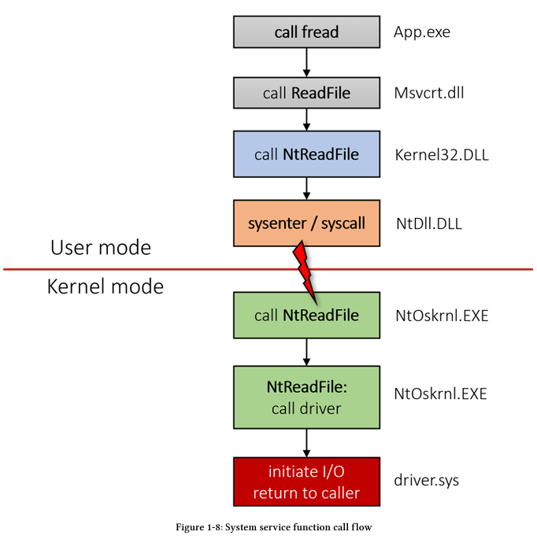
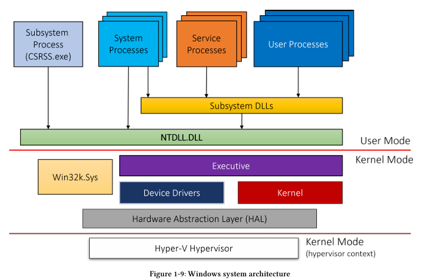

# Windows Internals

## Processes

Một process là một đối tượng quản lý và kiểm soát đại diện cho một phiên bản đang chạy của chương trình. Các process không chạy – các process quản lý. Các thread mới là những thứ thực thi mã và về kỹ thuật thì chạy.

Các yếu tố của một process:

- Một chương trình thực thi, chứa mã và dữ liệu ban đầu được sử dụng để thực thi mã trong process. Tuy nhiên một số process không có executable image (được tạo trực tiếp bởi kernel)
- Một không gian địa chỉ ảo
- Một access token (primary token): một đối tượng lưu trữ context của process , được các thread trong process sử dụng
- Một bảng xử lý riêng cho các executive objects như events, semaphores, files
- Một hoặc nhiều thread thực thi. Một process ở User mode thường tạo ra với 1 thread (main/WinMain)

## Virtual Memory

Mọi process đều có không gian địa chỉ ảo, tuyến tính và riêng biệt của riêng nó. Không gian địa chỉ ảo này là riêng tư, các processes khác không thể truy cập trực tiếp nó. Phạm vi không gian bắt đầu từ số 0 (về mặt kĩ thuật 64KB đầu tiên và cuối cùng của không gian địa chỉ không thể commited) và kéo dài tối đa đến bitness (32 hoặc 64 bit) của hệ điều hành:

- Đối với các tiến trình 32-bit trên hệ thống Windows 32-bit, kích thước không gian địa chỉ (address space) của tiến trình mặc định là 2 GB.
- Đối với các tiến trình 32-bit trên hệ thống Windows 32-bit có sử dụng thiết lập "tăng không gian địa chỉ ảo người dùng" (increase user virtual address space), chúng có thể được cấu hình để đạt tới 3 GB không gian địa chỉ cho mỗi tiến trình. Để có được phần không gian mở rộng này, tệp thực thi (executable) khởi tạo tiến trình đó phải được đánh dấu bằng cờ liên kết LARGEADDRESSAWARE trong phần PE header. Nếu không, nó vẫn sẽ bị giới hạn ở mức 2 GB.
- Đối với các tiến trình 64-bit (đương nhiên là trên hệ thống Windows 64-bit), kích thước không gian địa chỉ là 8 TB (đối với Windows 8 trở về trước) hoặc 128 TB (đối với Windows 8.1 trở về sau).
- Đối với các tiến trình 32-bit trên hệ thống Windows 64-bit, kích thước không gian địa chỉ là 4 GB nếu tệp thực thi có chứa cờ LARGEADDRESSAWARE trong PE header. Nếu không, kích thước vẫn giữ nguyên ở mức 2 GB.

Đơn vị cơ bản trong quản lý bộ nhớ được gọi là một trang (page). Mọi thuộc tính liên quan đến bộ nhớ luôn được áp dụng ở cấp độ trang (page granularity), ví dụ như trạng thái hoặc cơ chế bảo vệ của nó. Kích thước của một trang được xác định bởi kiến trúc CPU (và trên một số bộ xử lý, kích thước này có thể cấu hình được); dù trong trường hợp nào, trình quản lý bộ nhớ cũng phải tuân thủ theo đó. Kích thước trang thông thường (đôi khi được gọi là trang nhỏ) là 4 KB trên tất cả các kiến trúc phần cứng mà Windows hỗ trợ.

Mỗi trang (page) trong bộ nhớ ảo (virtual memory) có thể ở một trong ba trạng thái:

- Free (Tự do): Trang chưa được cấp phát (allocate) dưới bất kỳ hình thức nào; không có gì ở đó cả. Mọi nỗ lực truy cập vào trang này sẽ gây ra ngoại lệ access violation (vi phạm truy cập). Hầu hết các trang trong một tiến trình (process) mới được tạo đều ở trạng thái Free.
- Committed (Đã cam kết): Ngược lại với Free; đây là trang đã được cấp phát và có thể truy cập thành công (giả sử không xung đột với các thuộc tính bảo vệ - protection attributes; ví dụ, ghi dữ liệu vào một trang chỉ đọc read-only sẽ vẫn gây ra access violation). Các trang Committed được ánh xạ (map) vào RAM hoặc vào một tệp (chẳng hạn như page file).
- Reserved (Đã dự trữ): Trang chưa được commit, nhưng dải địa chỉ (address range) của nó đã được giữ chỗ để có thể commit trong tương lai. Từ góc độ của CPU, trạng thái này giống hệt như Free – mọi nỗ lực truy cập đều gây ra ngoại lệ access violation. Tuy nhiên, các yêu cầu cấp phát bộ nhớ mới sử dụng hàm VirtualAlloc (hoặc NtAllocateVirtualMemory, native API tương ứng) mà không chỉ định một địa chỉ cụ thể sẽ không cấp phát đè vào vùng Reserved này. Một ví dụ kinh điển về việc sử dụng bộ nhớ Reserved để duy trì không gian địa chỉ ảo liền mạch (contiguous) trong khi vẫn tiết kiệm dung lượng bộ nhớ Committed được mô tả ở phần sau của chương này trong mục "Thread Stacks" (Ngăn xếp luồng).

## System memory

Phần thấp (lower part) của không gian địa chỉ được dành cho các tiến trình user-mode sử dụng. Khi một thread cụ thể đang thực thi, không gian địa chỉ của tiến trình liên kết với nó sẽ hiển thị (visible) từ địa chỉ 0 cho đến giới hạn trên như đã mô tả trong phần trước. Tuy nhiên, hệ điều hành cũng phải "cư trú" ở đâu đó – và nơi đó chính là dải địa chỉ vùng cao (upper address range) được hỗ trợ trên hệ thống, cụ thể như sau:

- Trên các hệ thống 32-bit chạy không có thiết lập "tăng không gian địa chỉ ảo người dùng" (increase user virtual address space), hệ điều hành nằm ở 2 GB vùng cao của không gian địa chỉ ảo, từ địa chỉ 0x80000000 đến 0xFFFFFFFF.
- Trên các hệ thống 32-bit được cấu hình với thiết lập "tăng không gian địa chỉ ảo người dùng", hệ điều hành nằm ở phần không gian địa chỉ còn lại. Ví dụ, nếu hệ thống được cấu hình với 3 GB không gian địa chỉ người dùng cho mỗi tiến trình (mức tối đa), OS sẽ chiếm 1 GB vùng cao (từ địa chỉ 0xC0000000 đến 0xFFFFFFFF). Thành phần chịu ảnh hưởng nhiều nhất từ việc cắt giảm không gian địa chỉ này là bộ đệm hệ thống tệp (file system cache).
- Trên các hệ thống 64-bit chạy Windows 8, Server 2012 và các phiên bản trước đó, OS chiếm 8 TB vùng cao của không gian địa chỉ ảo.
- Trên các hệ thống 64-bit chạy Windows 8.1, Server 2012 R2 và các phiên bản sau này, OS chiếm 128 TB vùng cao của không gian địa chỉ ảo.

System space là nơi kernel, lớp trừu tượng phần cứng (Hardware Abstraction Layer) và các kernel driver cư trú sau khi được tải lên. Ví dụ nếu một kernel driver bị rò rỉ bộ nhớ, phần bộ nhớ đó sẽ không được giải phóng ngay cả khi driver đã được dỡ bỏ. Ngược lại các user-mode process không boa giờ gây rò rỉ bất cứ thứ gì tồn tại lâu hơn vòng đời của chúng. Kernel chịu trách nhiệm đóng và giải phóng mọi thứ của tiến trình đó khi đã kết thúc

## Threads

Thread trực tiếp chạy code.

Những thông tin quan trọng của một thread:

- Chế độ truy cập hiện tại (Current access mode), là user (người dùng) hoặc kernel (nhân).
- Ngữ cảnh thực thi (Execution context), bao gồm các thanh ghi bộ xử lý (processor registers) và trạng thái thực thi.
- Một hoặc hai ngăn xếp (stacks), được sử dụng để cấp phát biến cục bộ và quản lý lời gọi hàm.
- Mảng Thread Local Storage (TLS), cung cấp phương thức để lưu trữ dữ liệu riêng tư của thread (thread-private data) với ngữ nghĩa truy cập thống nhất.
- Độ ưu tiên cơ sở (Base priority) và độ ưu tiên hiện tại (động - dynamic priority).
- Processor affinity (Độ tương thích bộ xử lý), chỉ định các bộ xử lý nào mà thread được phép chạy trên đó.

Các trạng thái phổ biến nhất mà một thread có thể nắm giữ bao gồm:

- Running (Đang chạy): Hiện đang thực thi mã lệnh trên một bộ xử lý logic (logical processor).
- Ready (Sẵn sàng): Đang chờ được lập lịch (scheduled) để thực thi do tất cả các bộ xử lý phù hợp đều đang bận hoặc không khả dụng.
- Waiting (Đang chờ): Đang đợi một sự kiện (event) nào đó xảy ra trước khi tiếp tục. Một khi sự kiện xảy ra, thread sẽ chuyển sang trạng thái Ready.

## Thread Stacks

Mỗi thread có một ngăn xếp (stack) được sử dụng trong quá trình thực thi để lưu trữ các biến cục bộ, các tham số truyền vào hàm (trong một số trường hợp), và là nơi lưu trữ các địa chỉ trả về (return addresses) trước khi thực hiện các lời gọi hàm. Một thread có ít nhất một stack nằm trong không gian hệ thống (system/kernel space), và kích thước của nó khá nhỏ (mặc định là 12 KB trên hệ thống 32-bit và 24 KB trên hệ thống 64-bit).

Một thread user-mode có thêm một stack thứ hai nằm trong dải địa chỉ không gian người dùng (user-space) của tiến trình và nó lớn hơn đáng kể (theo mặc định có thể tăng trưởng lên tới 1 MB).

Kernel stack luôn luôn thường trú trong RAM khi thread đang ở trạng thái Running hoặc Ready. Ngược lại, user-mode stack có thể bị paged out (chuyển từ RAM xuống đĩa), giống như bất kỳ bộ nhớ user-mode nào khác.

Paged out: Hành động hệ điều hành chuyển dữ liệu từ RAM xuống ổ cứng (vào Page File) để giải phóng RAM cho các tác vụ khác.

Về mặt kích thước, user-mode stack được xử lý khác biệt so với kernel-mode stack. Nó khởi đầu với một lượng bộ nhớ committed nhất định (có thể nhỏ chỉ bằng một trang đơn lẻ), trong đó trang tiếp theo được thiết lập với thuộc tính PAGE_GUARD. Phần còn lại của không gian địa chỉ stack được đặt ở trạng thái reserved, do đó không gây lãng phí bộ nhớ.

Mục đích của việc này là để stack có thể tự mở rộng trong trường hợp mã lệnh của thread cần sử dụng nhiều không gian stack hơn. Nếu thread cần thêm không gian, nó sẽ truy cập vào "trang bảo vệ" (guard page), hành động này sẽ kích hoạt (throw) một ngoại lệ page-guard. Khi đó, trình quản lý bộ nhớ (memory manager) sẽ gỡ bỏ cơ chế bảo vệ của trang cũ, thực hiện commit thêm một trang kế tiếp, và đánh dấu trang mới này với thuộc tính PAGE_GUARD. Bằng cách này, stack sẽ tăng trưởng khi cần thiết, tránh việc toàn bộ bộ nhớ stack bị commit ngay từ đầu.

## System Services (a.k.a System Calls)

Hãy xem xét một ví dụ phổ biến (và đơn giản): một người dùng đang chạy tiến trình Notepad và sử dụng menu File / Open để yêu cầu mở một tệp. Mã của Notepad phản hồi bằng cách gọi hàm Windows API đã được tài liệu hóa là CreateFile. CreateFile được mô tả là được cài đặt (implemented) trong kernel32.dll, một trong các DLL của Windows subsystem.

Hàm này vẫn chạy trong user mode, vì vậy không đời nào nó có thể trực tiếp mở tệp. Sau một vài bước kiểm tra lỗi, nó gọi NtCreateFile, một hàm được cài đặt trong NTDLL.dll – một DLL nền tảng giúp cài đặt API được gọi là Native API, và là lớp mã thấp nhất vẫn còn nằm trong user mode. Hàm này (được tài liệu hóa trong bộ Windows Driver Kit dành cho các nhà phát triển driver thiết bị) chính là hàm thực hiện việc chuyển đổi sang kernel mode.

Trước khi chuyển đổi thực sự, nó đặt một con số, gọi là số dịch vụ hệ thống (system service number), vào một thanh ghi CPU (thanh ghi EAX trên kiến trúc Intel/AMD). Sau đó, nó phát ra một lệnh CPU đặc biệt (syscall trên x64 hoặc sysenter trên x86) để thực hiện chuyển đổi thực tế sang kernel mode, đồng thời nhảy tới một thủ tục định sẵn gọi là bộ điều phối dịch vụ hệ thống (system service dispatcher).

Bộ điều phối dịch vụ hệ thống này sẽ lần lượt sử dụng giá trị trong thanh ghi EAX đó làm chỉ mục (index) để tra cứu trong Bảng Điều phối Dịch vụ Hệ thống (SSDT - System Service Dispatch Table). Sử dụng bảng này, mã lệnh sẽ nhảy tới chính dịch vụ hệ thống (system call) đó.

Với ví dụ Notepad của chúng ta, mục nhập trong SSDT sẽ trỏ tới hàm NtCreateFile, được cài đặt bởi trình quản lý I/O (I/O manager) của kernel. Lưu ý rằng hàm này có cùng tên với hàm trong NTDLL.dll, và cũng có cùng các tham số. Phía kernel mới là nơi chứa phần cài đặt thực sự (real implementation). Một khi dịch vụ hệ thống hoàn tất, thread (luồng) sẽ quay trở lại user mode để thực thi lệnh nằm ngay sau lệnh sysenter/syscall

## General System Architecture

- User processes
- Subsystem DLLs: các DLL chứa API của một subsystem. Một subsystem là một góc nhìn cụ thể về các khả năng được kernel exposed. Từ Windows 8.1 chỉ còn tồn tại duy nhất Windows subsystem bao gồm như kernel32.dll, user32.dll, gdi32.dll, ... Chú yếu chứa các API chính thức của Windows
- NTDLL.DLL: DLL toàn hệ thống, cài đặt Windows Native API. Lớp mã thấp nhất trong user mode. Vai trò chính là thực hiện chuyển đổi sang kernel thông qua system call. NTDLL cũng quản lý Heap Manager, Image Loader, và một phần của user mode thread pool
- Service Processes: Các Service Processe là những tiến trình Windows bình thường nhưng có giao tiếp với Trình quản lý Điều khiển Dịch vụ (SCM - Service Control Manager, được cài đặt trong services.exe) và cho phép kiểm soát vòng đời của chúng ở một mức độ nào đó. SCM có thể khởi động (start), dừng (stop), tạm dừng (pause), tiếp tục (resume) và gửi các thông điệp khác tới các dịch vụ. Các dịch vụ thường thực thi dưới quyền của một trong các tài khoản Windows đặc biệt – Local System, Network Service hoặc Local Service
- Executive: là lớp trên của NtOskrnl.exe (thường gọi là "kernel"). Nó lưu trữ phần lớn mã lệnh chạy trong chế độ nhân (kernel mode). Thành phần này bao gồm hầu hết các "trình quản lý" (managers) khác nhau như: Trình quản lý Đối tượng (Object Manager), Trình quản lý Bộ nhớ (Memory Manager), Trình quản lý I/O, Trình quản lý Plug & Play, Trình quản lý Nguồn điện (Power Manager), Trình quản lý Cấu hình (Configuration Manager), v.v. Lớp này lớn hơn rất nhiều so với lớp Kernel nằm bên dưới nó.
- Kernel: Lớp Kernel thực thi (implements) những phần cơ bản nhất và nhạy cảm về thời gian nhất của mã hệ điều hành chế độ nhân. Điều này bao gồm việc lập lịch cho luồng (thread scheduling), điều phối ngắt và ngoại lệ (interrupt and exception dispatching), và cài đặt các nguyên thủy kernel (kernel primitives) khác nhau như mutex và semaphore. Một số mã của lớp Kernel được viết bằng ngôn ngữ máy đặc thù cho từng loại CPU để đạt hiệu suất cao và để truy cập trực tiếp vào các chi tiết cụ thể của phần cứng CPU.
- Device Drivers Device drivers là các mô-đun kernel có thể nạp được (loadable kernel modules). Mã của chúng thực thi trong chế độ nhân, do đó sở hữu toàn bộ quyền lực của kernel.
- Win32k.sys Đây là thành phần chế độ nhân của phân hệ Windows (Windows subsystem). Về cơ bản, nó là một mô-đun kernel (driver) chịu trách nhiệm xử lý phần giao diện người dùng (user interface) của Windows và các API Giao diện Thiết bị Đồ họa cổ điển (GDI - Graphics Device Interface). Điều này có nghĩa là tất cả các thao tác liên quan đến cửa sổ (như CreateWindowEx, GetMessage, PostMessage, v.v.) đều được xử lý bởi thành phần này. Phần còn lại của hệ thống hầu như không có kiến thức gì về giao diện người dùng (UI).
- Hardware Abstraction Layer (HAL - Lớp Trừu tượng Phần cứng) HAL là một lớp trừu tượng hóa phần mềm nằm trên phần cứng gần nhất với CPU. Nó cho phép các trình điều khiển thiết bị (device drivers) sử dụng các API mà không cần kiến thức chi tiết và cụ thể về những thứ như Bộ điều khiển ngắt (Interrupt Controllers) hay Bộ điều khiển DMA (DMA controller). Đương nhiên, lớp này chủ yếu hữu ích cho các driver được viết để xử lý các thiết bị phần cứng.
- System Processes (Các tiến trình hệ thống) "System processes" là một thuật ngữ bao trùm được dùng để mô tả các tiến trình thường "chỉ nằm đó" (just there), thực hiện công việc của chúng mà bình thường không ai giao tiếp trực tiếp với chúng. Tuy nhiên chúng vẫn quan trọng, và một số thực tế là cực kỳ thiết yếu đối với sự vận hành ổn định của hệ thống. Việc chấm dứt (terminate) một số trong chúng là lỗi chí mạng và sẽ gây ra sập hệ thống (màn hình xanh). Một số tiến trình hệ thống là tiến trình nguyên bản (native processes), nghĩa là chúng chỉ dùng native API (API được cài đặt bởi NTDLL). Các ví dụ bao gồm Smss.exe, Lsass.exe, Winlogon.exe, và Services.exe
- Subsystem Process (Tiến trình phân hệ) Tiến trình phân hệ Windows, chạy tệp ảnh Csrss.exe, có thể được xem như một trợ thủ cho kernel để quản lý các tiến trình chạy dưới phân hệ Windows. Nó là một tiến trình cực kỳ quan trọng (critical process), nghĩa là nếu bị tắt (killed), hệ thống sẽ bị sập. Có một bản thể Csrss.exe cho mỗi phiên làm việc (session), vì vậy trên một hệ thống chuẩn sẽ có hai bản thể tồn tại – một cho session 0 và một cho phiên người dùng đã đăng nhập (thường là 1). Mặc dù Csrss.exe là "người quản lý" của phân hệ Windows (cái duy nhất còn lại ngày nay), tầm quan trọng của nó vượt xa vai trò này.
- Hyper-V Hypervisor Hyper-V hypervisor tồn tại trên các hệ thống Windows 10 và Server 2016 (trở về sau) nếu chúng hỗ trợ Bảo mật Dựa trên Ảo hóa (VBS - Virtualization Based Security). VBS cung cấp một lớp bảo mật bổ sung, trong đó hệ điều hành thông thường thực chất là một máy ảo được điều khiển bởi Hyper-V. Hai Cấp độ Tin cậy Ảo (VTLs - Virtual Trust Levels) riêng biệt được định nghĩa: VTL 0 bao gồm user-mode/kernel-mode bình thường mà ta đã biết, và VTL 1 chứa secure kernel (nhân bảo mật) và Chế độ Người dùng Cô lập (IUM - Isolated User Mode)

## Handles and Objects

Windows kernel cung cấp nhiều loại đối tượng khác nhau để sử dụng bởi các tiến trình user-mode, bởi chính bản thân kernel và bởi các driver kernel-mode. Các instances của các loại này là những cấu trúc dữ liệu nằm trong system space, được tạo ra bởi Object Manager (thuộc Excecutive) khi có yêu cầu từ mã user-mode hoặc kernel-mode. Các đối tượng được quản lý bằng cơ chế đếm tham chiếu (reference counted) – chỉ khi tham chiếu cuối cùng tới đối tượng được giải phóng thì đối tượng đó mới bị hủy và giải phóng khỏi bộ nhớ.

Vì các bản thể đối tượng này nằm trong system space, chúng không thể được truy cập trực tiếp bởi user mode. User mode bắt buộc phải sử dụng một cơ chế truy cập gián tiếp, được gọi là handles. Một handle là một chỉ mục trỏ tới một mục nhập (entry) trong một bảng được duy trì trên cơ sở từng tiến trình (process-by-process basis), bảng này được lưu trong kernel space, và mục nhập đó trỏ tới đối tượng kernel thực sự đang nằm trong system space.

Có nhiều hàm dạng Create* và Open* khác nhau để tạo/mở đối tượng và lấy về handles tới các đối tượng này. Ví dụ, hàm user-mode CreateMutex cho phép tạo hoặc mở một mutex (tùy thuộc vào việc đối tượng đó có được đặt tên và đã tồn tại hay chưa). Nếu thành công, hàm sẽ trả về một handle tới đối tượng đó. Giá trị trả về là 0 đồng nghĩa với một handle không hợp lệ (và lời gọi hàm thất bại). Ngược lại, hàm OpenMutex cố gắng mở một handle tới một mutex đã được đặt tên (named mutex). Nếu mutex với tên đó không tồn tại, hàm sẽ thất bại và trả về null (0).

Mã nguồn Kernel (và driver) có thể sử dụng hoặc một handle hoặc một con trỏ trực tiếp (direct pointer) tới một đối tượng. Sự lựa chọn này thường dựa trên API mà mã đó muốn gọi. Trong một số trường hợp, một handle do user mode cung cấp cho driver phải được chuyển đổi thành một con trỏ thông qua hàm ObReferenceObjectByHandle. Chúng ta sẽ thảo luận về các chi tiết này trong một chương sau.

